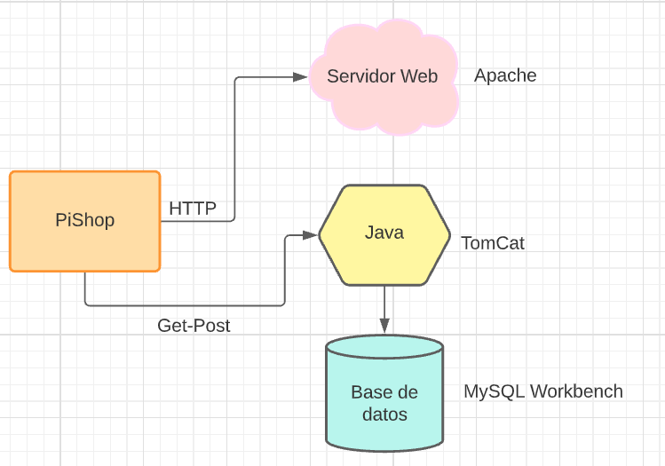

# Proyecto-Final-Global-DAW

>En este repositorio se encuentra nuestro proyecto final global, que ha sido fruto del trabajo del tercer trimeste de _CFGS de Desarrollo Web_.

## Introducción

La premisa de este proyecto es, mediante una idea opcional, desarrollar una aplicación que conecte una página web a la base de datos, aplicando CRUD, y al servidor web.

La idea de este proyecto ha concluido en una **pizzería**. Una idea simple pero que podemos ampliar hasta cumplir los requisitos estipulados del proyecto y más allá.

Tendremos una página web que enlaza a otras tres páginas, la pizzería se llamará **PiShop**.

